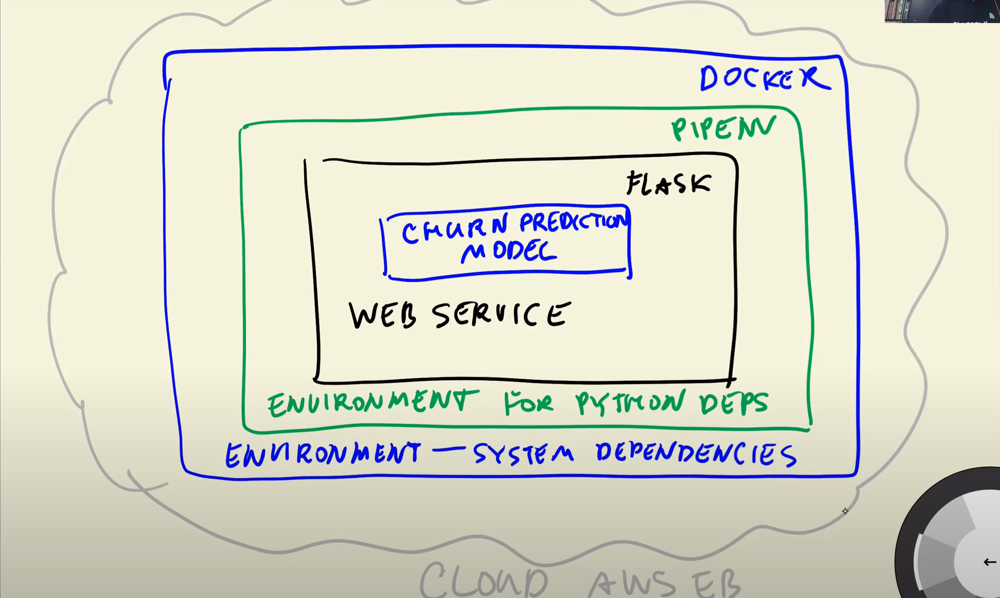

# 5.1 Intro
- Will use a model we trained previously for churn prediction and deploy it as web service
- Save the model from Jupyter Notebook to file `model.bin`
- 
-  

# 5.2 Saving and loading the model
- Saving the model to pickle
- Loading the model from pickle
- Turning our notebook into a Python script

# 5.3 Web services: introduction to Flask
- writing a simple ping/pong app
- querying it with `curl` and browser

# 5.4 Serving the churn model with Flask
- Wrapping the predict script into a Flask app
- Querying it with `requests`
- Preparing for production: gunicorn
- Running it on Windows with waitress

# 5.5 Python virtual environment: Pipenv
- dependency and environment management
- why we need virtual environment
- installing pipenb
- installing libraries with pipenv
- running things with pipenv
  
# 5.6 Environment management: Docker
- why do we need docker
- running a python image with docker
- dockerfile
- building & running a docker image

# 5.7 Deployment to the cloud: AWS Elastic Beanstalk (optonal)
- Installing the eb cli
- Running eb locally
  - PyYAML version at `5.3.1` (otherwise, _cython_sources_ error)
  - use `awsebcli==3.20.3`, had issues w `3.20.10`
  - `eb local run --port 9696 --debug --verbose`
  - _"ERROR: NotSupportedError - You can use "eb local" only with preconfigured, generic and multicontainer Docker platforms."_
- Deploying the model
  